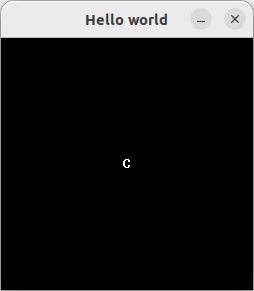

# Playground

Playground is a minimal C library to draw ASCII characters. It is made for learning purpose for ISART Digital.

It is inspired from [libtcod](https://github.com/libtcod/libtcod), a library frequently used in roguelikes.

## Compiling Playground

Playground include all its dependencies so it should compile out of the box.

### Build on Linux/Cygwin

```bash
make
```

### Build on Windows

Open and build playground.sln on Visual Studio 2019.

## Dependencies (all included)

- [glfw3](https://github.com/glfw/glfw)
- GL headers (using [glad2](https://github.com/Dav1dde/glad/tree/glad2))
- [miniaudio](https://github.com/mackron/miniaudio)

## Examples

See [examples/](examples) folder for complete examples.

Code:

```c
#include <GLFW/glfw3.h>

#include <playground.h>
#include <playground_backend_glfw.h>

int main(int argc, char* argv[])
{
    // Init
    GLFWwindow* window;
    pg_backend_glfw_helper_init(&window, "Hello world", pg_config_simple(21, 21, "assets/DB_curses_12x12.png"));

    // Main loop
    while (glfwWindowShouldClose(window) == GLFW_FALSE)
    {
        pg_backend_glfw_poll_events();
        pg_clear_all();
        
        // Place character C at 10,10 coordinates
        pg_put_char(10, 10, 'C', PG_COL_REPLACE);

        pg_render();
        glfwSwapBuffers(window);
    }
    
    // Shutdown
    pg_shutdown();
    glfwDestroyWindow(window);
    glfwTerminate();

    return 0;
}
```

Result:

